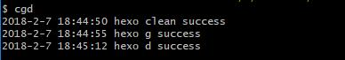

**题记**：每次更新hexo博客都要执行三个命令:
* hexo clean
* hexo g
* hexo d

这显然是重复到不行的重复操作，作为一个有极客精神的伪极客爱好者，自然是无法忍受的，所以今天就来研究使用node开发shell（命令行）程序。
<!-- more -->
## search

学习，自然要先查资料，打开google，看到我们熟悉的阮一峰老师的名字，于是决定今天第一个就是它了：[Node.js命令行程序开发教程](http://www.ruanyifeng.com/blog/2015/05/command-line-with-node.html)

## start

### 可执行脚本

同样先新建一个hello文件，使用js语言写入：

```
#!/usr/bin/env node  // 保证linux中同样可以使用
console.log('hello world');
```

然后修改 hello 的权限：

```
$ chmod 755 hello
```

就可以执行了：

```
$ ./hello
hello world
```

如果想把 hello 前面的路径去除，可以将 hello 的路径加入环境变量 PATH。但是，另一种更好的做法，是在当前目录下新建 package.json ，写入下面的内容。

```
{
  "name": "hello",
  "bin": {
    "hello": "hello"
  }
}
```

然后执行 npm link 命令，这时候可能会有杀毒软件提示攻击，不要在意，允许操作就好：

```
$ npm link
```

现在再执行 hello ，就不用输入路径了。

```
$ hello
hello world
```

### 命令行参数的原始写法

命令行参数可以使用node.js提供的系统变量 process.argv 获取；

```
#!/usr/bin/env node
console.log('hello ', process.argv[2]);
```

执行时，直接在脚本文件后面，加上参数即可：

```
$ ./hello tom
hello tom
```

上面的代码中实际执行的是 node ./hello tom, 对应的 process.argv 是 ['node', '/path/to/hello', 'tom']

### 新建进程

脚本可以通过 child_process 模块新建子进程，从而执行 Unix 系统命令。

```
#!/usr/bin/env node
var name = process.argv[2];
var exec = require('child_process').exec;

var child = exec('echo hello ' + name, function(err, stdout, stderr) {
  if (err) throw err;
  console.log(stdout);
});
```

到这里其实我们已经掌握了关键，就是 child_process 的 exec 函数来执行系统命令，从第二个函数也能看出来是一个异步函数，可以写出如下代码：

```
#! /usr/bin/env node

var exec = require('child_process').exec;

exec('hexo clean', function (err, stdout, stderr) {
    if (err) throw err;
    console.log(new Date().toLocaleString(),'hexo clean success');
    exec('hexo g', function (e2, s2, st2) {
        if (e2) throw e2;
        console.log(new Date().toLocaleString(),'hexo g success');
        exec('hexo d', function (e3, s3, st3) {
            if (e3) throw e3;
            console.log(new Date().toLocaleString(),'hexo d success');
        });
    });
});
```
三层回掉很难看，async改造他
```
let runShell = function (str) {
  return new Promise((resolve, reject) => {
    exec(str, (err, stdout, stderr) => {
      if (err) throw err;
      console.log(new Date().toLocaleString(), str + 'run success');
      resolve();
    });
  });
}

let runAll = function () {
  await runShell('hexo clean');
  await runShell('hexo g');
  await runShell('hexo d');
}

runAll();
```
在 Git Bash 中执行：

```
$ chmod 755 cgd
```

接着在 package.json 最后加入bin：

```
...
 "bin": {
    "cgd": "cgd"
  }
}
```
执行 npm link,杀毒软件提示，我们不理他，成功后，直接：

