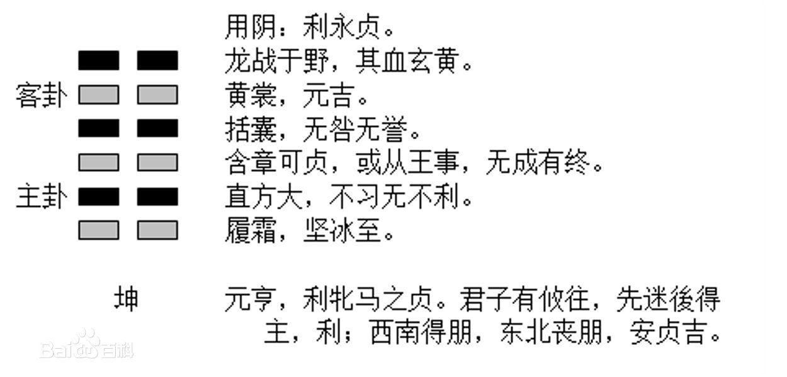

随笔，不是一天之随笔，而是一整个月的偶得之秒思。
<!-- more -->

# 04-03

大略是昨天晚上，找到一张壁纸，一只软萌萌毛乎乎的皮卡丘趴在只属于他自己的房子上面幸福地笑着。

感觉一下子心就被软化了，一边调成壁纸一边想，这个世界对我够好了，真的够好了，怎么还有那么多不满意呢？

明明打定主意车到山前必有路，做好自己的事之后就听天由命，还每天为不值得的事费心思，何不学着放空自己，将精力集中到当下的事呢？

坤卦，利永贞，明明决定如同大地般宽广的心胸，何必在乎那么多，设定好计划，按步骤执行，时间不该按天算，应该按年算的，一年一个计划，不逼迫自己，也不太着急。

成熟，稳重起来。