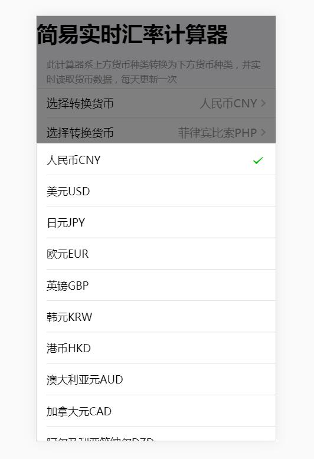

打算写一个完整的项目，货币计算器，之所以选这个，一个是生活使用，另一个就是简单，可以快速开发出来。

<!-- more -->

## 准备

1. 使用vue + vux；
2. 使用聚合数据[免费接口](https://www.juhe.cn/docs/api/id/80)

## 随便在页面放几个框框

因为直接使用了 vux 提供的模板，所以直接新建 CalPage.vue 在 main.js 中引入就可以开搞了:




货币选择采用了 vux 的 popupRadio 组件（如无特别说明，后面所有都是 vux 的组件），纯粹觉得好看。。。

实际使用中碰到由于货币种类太多，popupRadio 的弹框全屏的情况，由于美观问题和此组件点击已选的选项无法关闭弹框的情况，所以给弹框加了一个最大高度。

## 代理数据

使用 vue-cli 的代理：

在vue-cli项目中的config文件夹下的index.js配置文件中，找到：

```
dev: {
    env: require('./dev.env'),
    port: 8080,
    autoOpenBrowser: true,
    assetsSubDirectory: 'static',
    assetsPublicPath: '/',
    proxyTable: {},   
    cssSourceMap: false
  }
```

其中 `proxyTable` 项目就是代理选项，但我们不会直接在这里写我们的代理接口，不论出于可维护性，还是工程化要求，我们新建一个文件： `proxyList.js`

```
module.exports = {
    proxy: {
        // 请求国家列表
        '/getList': {
            target: 'http://op.juhe.cn/onebox/exchange/list?key=appid',
            changeOrigin: true,
            pathRewrite: {
                '^/getList': ''
            }
        },
        // 请求实时汇率
        '/currency': {
            target: 'http://op.juhe.cn/onebox/exchange/currency',
            changeOrigin: true,
            pathRewrite: {
                '^/currency': ''
            }
        }
    }
}
```

请求实时汇率时不用添加参数，由前端传就好。

## 后台开发

后台实际就是一个对应客户访问，一个就是将之前 vue-cli 代理的数据接口放到后台来；

另外，由于使用的是聚合数据的免费接口

打算使用 epxress 开发，直接生成器生成项目模板，然后再router文件夹下建立 api.js, 在主函数中引用后就可以开搞了；

首先自然是保证接口的正常使用，因为要访问外部服务器的内容，这里引入了 request 模块。

```
var request = require('request');

router.get('/getList', (req, res, next) => {
    request.get('http://op.juhe.cn/onebox/exchange/list?key=appkey', (err, resp, body) => {
        res.send(body);
    })
})

router.get('/currency', (req, res, next) => {
    request.get('http://op.juhe.cn/onebox/exchange/currency' + parseUrl(req.query), (err, resp, body)  => {
        res.send(body);
    })
})

```

一时想不起来node.js 的url处理函数。。。这里需求比较简单，找一定比自己写慢，索性就简单实现一下，后期找到更好的，直接换名就好。

```
function parseUrl (objs) {
    var str = '?';
    var obj = typeof objs === 'object'? objs : {};

    for(var i in obj) {
        str += i + '=' + obj[i] + '&'
    }
    return str.replace(/\&$/, '');
}
```

### 数据缓存

接下来做的事就比较牛逼了，由于我们聚合数据免费接口每天请求次数只有一百次，实际测试都不够用，这时候直接请求他们的数据显然不现实，而且考虑数据的实时要求其实并不高，每天更新一次就够，这时候考虑就要设计数据缓存，减少外部访问次数，也使用户体验流畅。

另外，之前请求实时汇率时我们的 appkey 也暴露在前台，这显然是非常危险的，整体移到后端也很有必要。

先做个简易版，原谅我个自学成才的小前端，做啥都是简单版。。。

这里涉及到逻辑的更改了，之前所有数据都是需要时前端发请求才取，这次我们直接在服务器启动时，请求一次，然后每天过0点请求一次，平时用户访问的就直接从缓存中取。

仔细一考虑，实际使用中，请求实时汇率时，总共有88个货币种类，两两配对，n(n-1)/2 ,一共可以有3828种，每天100次，要39天才能请求完，显然不合理。

这里为了以最小代价完成功能，计划：

1. 惰性请求数据，在用户发起请求时查阅数据池有无数据，有则直接返回，没有就发送请求；
2. 数据更新时间改为一个月，随着时间积累，最终完成数据构建。

暂时不用数据库的情况下，先把数据保存在本地：

```
var countryList ;// 汇率种类数据
var currencyObj = {} // 实时汇率数据
```

首先改造请求货币列表的接口：判断缓存里有没有数据，有就返回缓存，没有就请求数据并计入缓存。

```
router.get('/getList', (req, res, next) => {
    if (countryList.length === 0) {
        request.get('http://op.juhe.cn/onebox/exchange/list?key=' + appKey, (err, resp, body) => {
            countryList = body;
            res.send(countryList);
            countryList.state = '来自本地';
        })
    } else {
        res.send(countryList);
    }
})
```

之后改造实时汇率请求接口，将from和to拼成键，而且由于接口直接返回两种货币相互交换位置的结果，所以我们一次请求其实可以记录两个方向的结果：

```
router.get('/currency', (req, res, next) => {
    var from = req.query['from']
    var to = req.query['to']
    if (from === to) {
        res.send('传入相同货币！');
    }
    
    if (currencyObj[from+to] == null) {
        getCurrency(from, to).then((data)=> {
            var obj1 = JSON.parse(data);
            obj1.result.splice(1, 1);
            console.log(obj1)
            var obj2 = JSON.parse(data);
            obj2.result.splice(0, 1);
            console.log(obj2)
            currencyObj[from + to] = obj1
            currencyObj[to + from] = obj2
            res.send(currencyObj[to + from]);

            currencyObj[from + to].state = '来自本地';
            currencyObj[to + from].state = '来自本地';
        }).catch((err) => {
            res.send('error');
            console.log('请求实时汇率出错')
        });
    } else {
        res.send(currencyObj[from + to]);
    }
})
```

接着不急，先放到服务器上测试一下。测试成功后，接着完善前端提示信息，例如不能输入同样的货币，加载给一个加载提示，以防网络状态不好的情况。

